# Godwyn the Golden — Boss Fight

As much as we all love the Promised Consort boss fight, lets be real, it's not what any of us were hoping for. In fact, what we all wanted was to fight Godwyn the Golden, the Prince of Death himself. In this project, I attempt to use advanced tools (namely Claude Fable 5) to make this boss fight a reality. Stay tuned as I progress!

## Phase 1 Character Renders

Godwyn the Golden in his idealized prime — a demigod swordsman of peerless grace. All renders are GPU-accelerated via Cycles (OptiX/CUDA on 2x RTX 3060 Ti), produced headlessly from reproducible Blender scripts.

### Character Sheet (Multiple Views)

| Front | Three-Quarter Left | Three-Quarter Right |
|:---:|:---:|:---:|
|  | 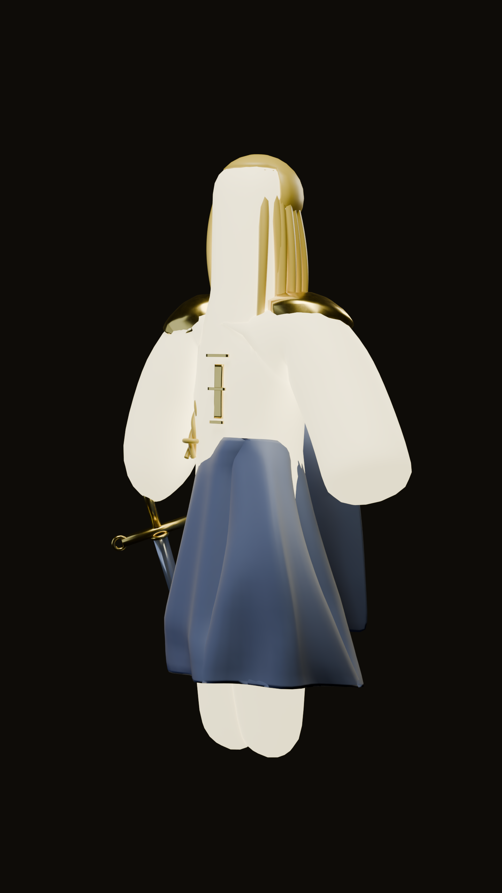 |  |

| Back | Side | Face Close-up |
|:---:|:---:|:---:|
| 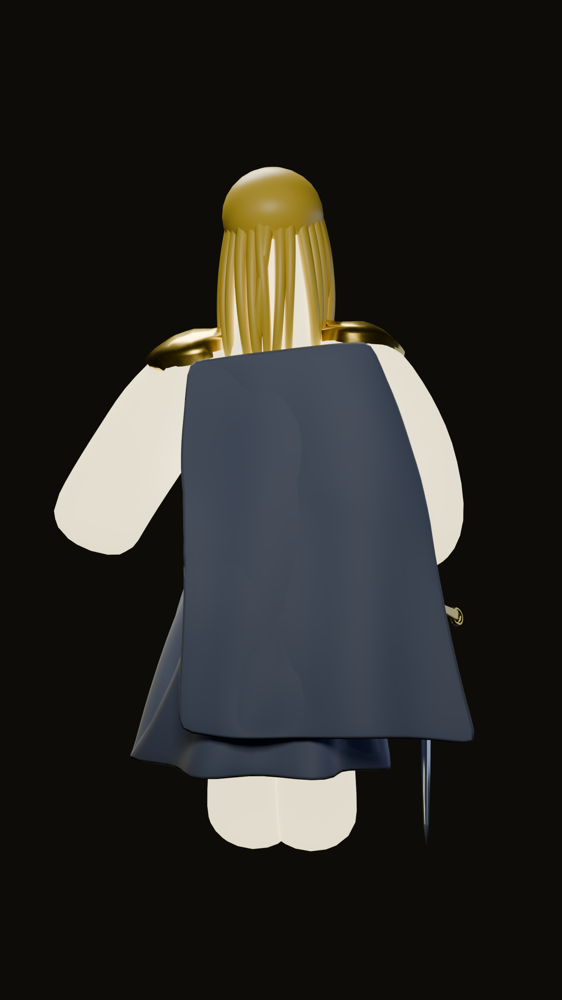 | 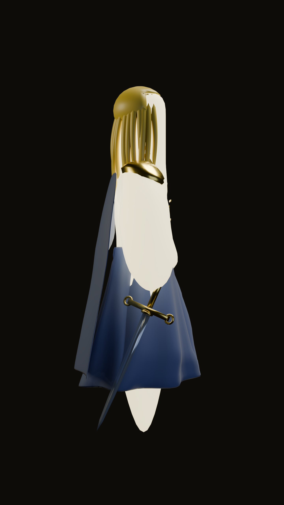 |  |

### Weapon Detail


Gold-hilted, blue-tinged blade with filigree crossguard — the mark of his grace.

### Moveset Action Poses

Seven signature poses from Phase 1 combat:

| Low Hang Guard | X Combo Hit 1 | X Combo Hit 2 |
|:---:|:---:|:---:|
| 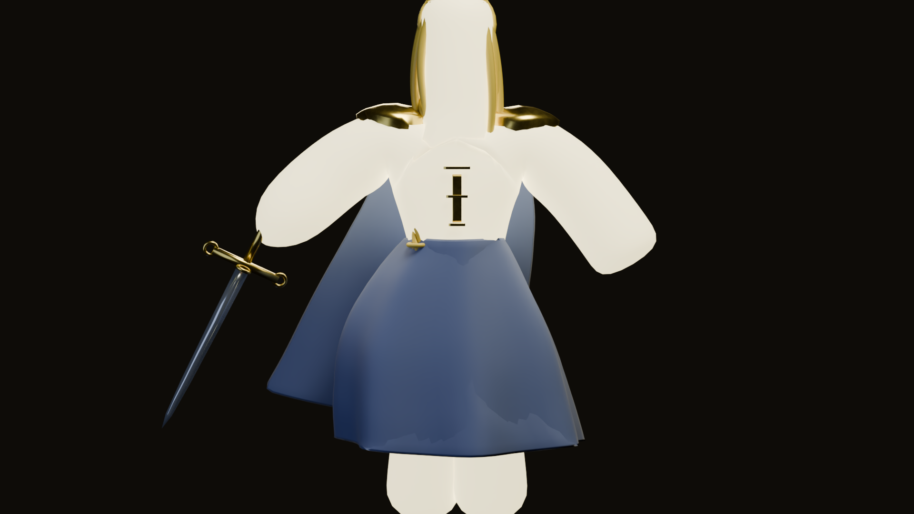 | 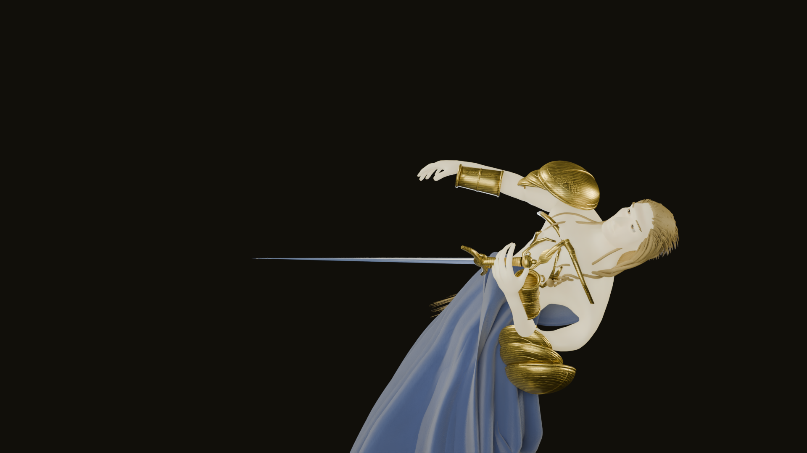 | 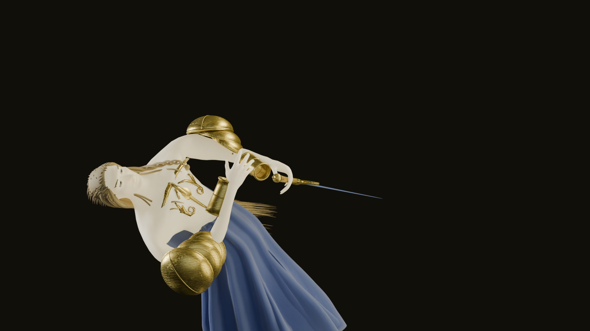 |

| Overhead Slam | Backhand Rotation | Jump Lunge |
|:---:|:---:|:---:|
| 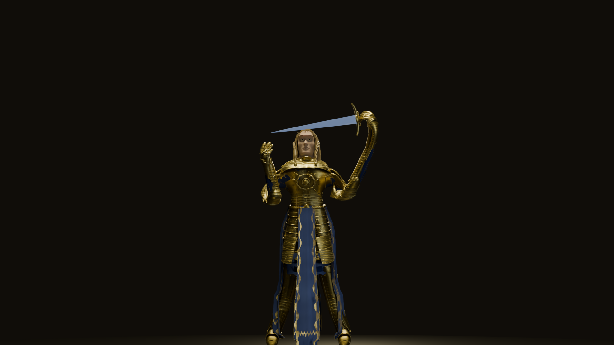 | 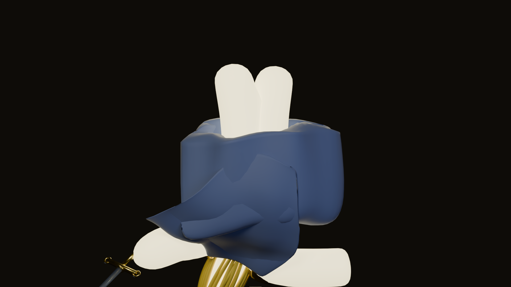 | 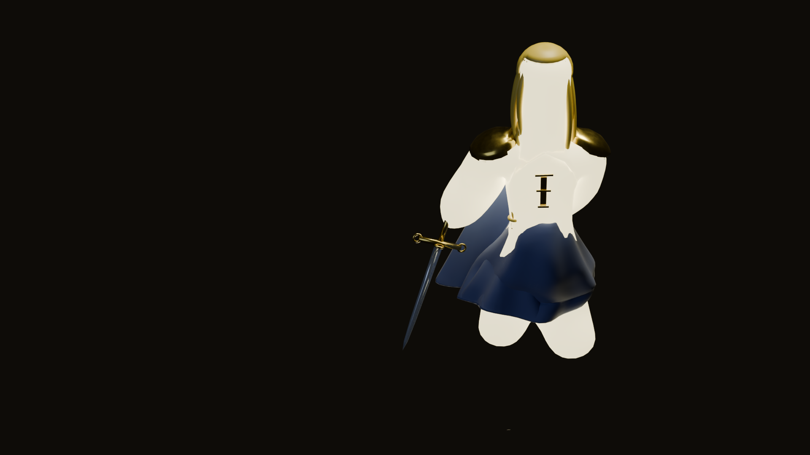 |

| Double Spin |
|:---:|
| 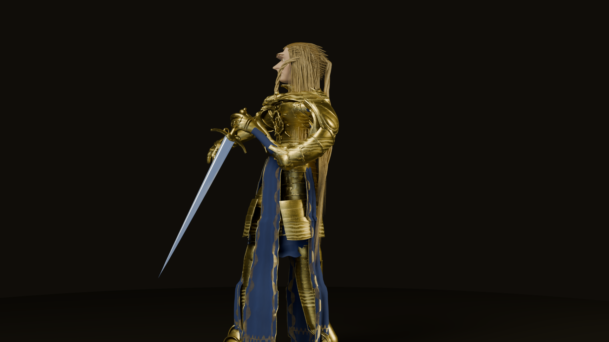 |

## Rigged + Textured Game Asset (Phase 4 — Updated)

`models/godwyn_game.glb` is the **fully rigged, physics-chain-enhanced game-ready asset** re-exported in Phase 4 from `godwyn_p2_robe.blend` via `scripts/phase4_export_p4_final.py`. This export supersedes all previous versions and includes the full robe/cape/hair physics bone chains added in Phases 2–3, cleaned skinning weights, and `Godwyn_Sword` + `Godwyn_Gauntlet` parented to the `RightHand` bone. Final combat animations will be retargeted Mixamo mocap applied on top of this rig.

| Property | Value |
|---|---|
| File size | ~20.6 MB |
| Bones | 121 (24 Mixamo body + 97 phys chains: 64 robe, 21 cape, 12 hair) |
| Meshes | 3 (char1 skinned body, Godwyn_Sword, Godwyn_Gauntlet) |
| Materials | 4 (GodwynGameMat, GodwynGauntletMat, GodwynSwordGoldMat, GodwynSwordMat) |
| Textures | 2 packed PNGs (godwyn_albedo 2048×2048, metallic-roughness 2048×2048) |
| Rig | Skinned (121 VGs on char1), rest-pose bind, +Y up (glTF 2.0) |
| Sword | Godwyn_Sword + Godwyn_Gauntlet parented to RightHand bone |
| Physics chains | 8×8 robe grid (front/back/side L/C/R), 3×7 cape (L/C/R), 2×4 hair |
| Skinning | Cleaned weights (Phase 1), exclusive phys masks + cloth drape (Phase 3) |

### Phase 4 Motion Previews (EEVEE)

EEVEE quick-renders showing deformation across rest, walk, and sword swing poses — verifying the rig and robe/cape chain deformation before Mixamo mocap retargeting:

| Rest Pose | Walk Stride | Overhead Swing | Follow-Through + Robe Drape |
|:---:|:---:|:---:|:---:|
| 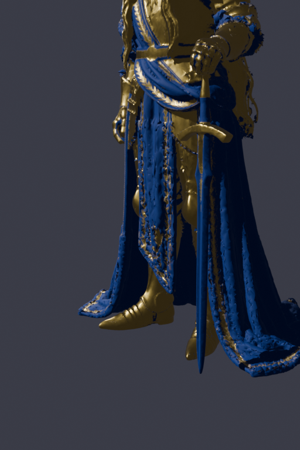 | 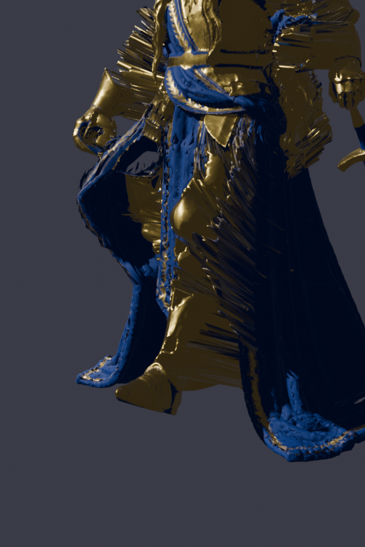 | 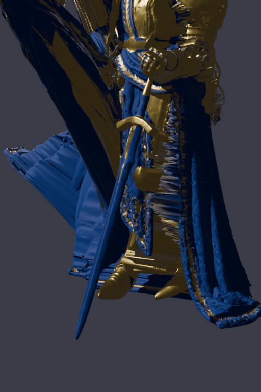 | 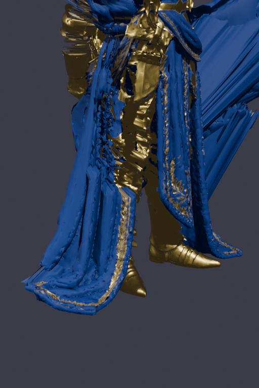 |

### Game Asset Turnaround

| Front | Three-Quarter | Side |
|:---:|:---:|:---:|
| 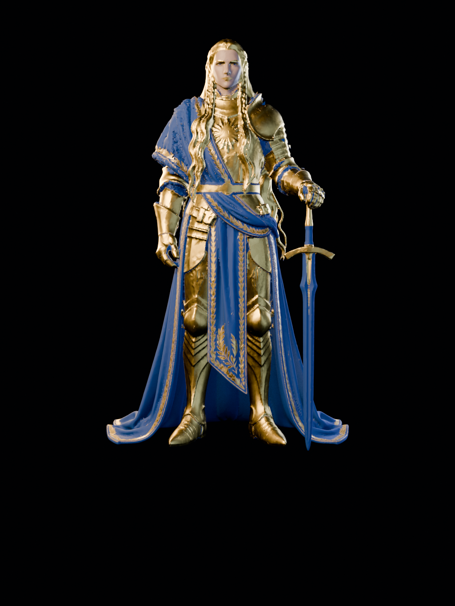 | 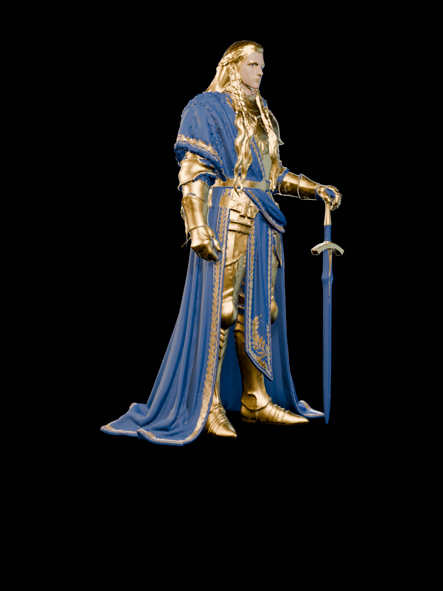 | 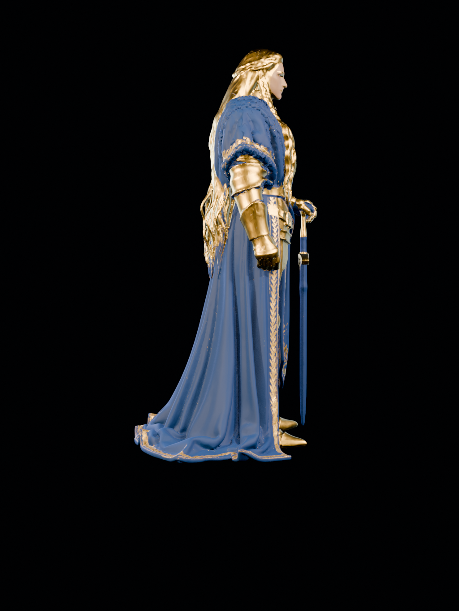 |

## Animatable Game Asset (Phase 1 pipeline)

`models/godwyn_phase1.glb` is the Godot-4-ready export — a fully animatable glTF 2.0 asset verified by `scripts/07_export_glb.py`:

| Property | Value |
|---|---|
| File size | 74.9 MB |
| Armatures | 1 (`Godwyn_Armature`, 30 bones) |
| Meshes | 8 (body, armor, tabard, hair, sword, eyes, void crack + extras) |
| Blendshapes | 7 `Expr_*` shape keys (face expressions, Godot-ready) |
| Materials | 7 (6 with baseColor + normal maps, 1 eye material) |
| Textures | 18 baked PNGs (basecolor / metalRoughness / normal per mesh) |
| Rig | Skinned, rest-pose bind, +Y up (glTF 2.0 convention) |

The blue cloth is exported as `Godwyn_Tabard` — an integrated hanging front tabard/surcoat panel (waist-to-floor) with gold laurel embroidery, skinned to pelvis/spine/thigh/shin bones for natural cloth deformation. This is NOT a back cape — it is woven into the armor ensemble as per the SPEC.

The `.blend` keeps its procedural Cycles beauty materials intact; the `.glb` ships baked texture maps baked by `03b_bake_maps.py` so surface detail (pores, weave, gold wear, hair streaks) survives the glTF export.

## How to Regenerate

All renders are generated deterministically from Python scripts via Blender's headless mode. To regenerate the full asset suite:

```bash
ssh mossad "cd ~/godwyn-boss-fight && bash scripts/build_all.sh"
```

This runs all phases (0–7) sequentially:
- **Phase 0:** Environment check, GPU device enumeration (OptiX gate)
- **Phase 1:** Base humanoid mesh via MPFB2 (anatomical 19 158-vert human)
- **Phase 2:** Armor, robe, hair, longsword on the MPFB2 body
- **Phase 3:** Procedural materials (skin SSS + inner glow, gold, robe, blade, hair, void)
- **Phase 4:** Armature (30 bones), dark-fantasy lighting rig, 8 cameras
- **Phase 4b:** Macro form-check renders (raking light clay views)
- **Phase 4c:** GPU bake procedural detail → PNG maps + export base GLB
- **Phase 5:** Character sheet renders (7 views, 2K portrait)
- **Phase 6:** Moveset pose renders (7 action stills, 2K cinematic)
- **Phase 7:** Final animatable GLB export + verification gate (Godot-ready)

Outputs:
- `models/godwyn_phase1.blend` — complete rigged model (procedural beauty mats)
- `models/godwyn_phase1.glb` — animatable Godot-4-ready export (baked textures)
- `models/textures/` — 18 baked PNG maps (source for the GLB)
- `renders/character/*.png` — character sheet (2K portrait, 2048×2560)
- `renders/moveset/*.png` — pose stills (2K cinematic, 1440×2560)

For details on the build process, see `blender-build-plan.txt`.

## X-Slash Animation (Phase 4 — First Authored Moveset Animation)

`models/godwyn_xslash.glb` is the **first authored moveset animation** — the X-slash combo fully keyframed and exported as a self-contained glTF 2.0 asset.

The X-slash is Godwyn's signature opener: from a low ready guard, he winds up over his right shoulder and drives a diagonal cut down to his lower-left (`\`), then immediately coils to his upper-left and delivers the crossing cut down to his lower-right (`/`). The two arcs cross in front of him to form an X. Power comes from the spine and shoulder rotation, not just the wrist. Total duration: 64 frames / 2.13s @ 30fps.

`renders/game/xslash.mp4` is the EEVEE render with a reflective environment (metallic ground plane, warm golden key light, cool blue fill, amber rim), encoded at 30fps via ffmpeg.

| Property | Value |
|---|---|
| File | `models/godwyn_xslash.glb` |
| File size | ~20.4 MB |
| Bones | 121 (24 Mixamo body + 97 physics chains) |
| Animation track | `ArmatureAction` — 64 frames / 2.13s @ 30fps |
| Meshes | char1 (skinned body) + Godwyn_Sword |
| Skinning | 1 skinned mesh, 121 vertex groups, rest-pose bind |
| Up axis | +Y (glTF 2.0) |
| Render | `renders/game/xslash.mp4` — EEVEE, 1280×720, 30fps |

Authored via `scripts/anim_xslash.py` (keyframe definitions) and exported via `scripts/phase4_xslash_export_glb.py`. The animation was verified by re-importing the .glb and confirming the animation track, frame count, and skinning are intact.

## Mocap Double Combo — Phase 4 Final Export

`models/godwyn_mocap_combo.glb` is the **Phase 4 final deliverable** — the retargeted Mixamo Double Combo mocap action baked onto the full game rig with cloth simulation (cape + robe Verlet chains), exported as a self-contained glTF 2.0 asset. This is the canonical animated game asset for the Godwyn boss fight.

`renders/game/mocap_combo.mp4` is the EEVEE render with a reflective dark-fantasy environment (highly metallic ground, warm golden key, cool blue rim, soft fill), encoded at 30fps via ffmpeg.

| Property | Value |
|---|---|
| File | `models/godwyn_mocap_combo.glb` |
| File size | ~20.9 MB |
| Bones | Full armature (Mixamo body + cape/robe chains) |
| Animation track | `Godwyn_DoubleCombo` — 67 frames / 2.79s @ 24fps |
| Meshes | char1, CapeGrid, RobeGrid (all skinned) + Godwyn_Sword |
| Skinning | Armature modifiers + vertex groups on all deforming meshes |
| Cloth | CapeGrid + RobeGrid baked cloth simulation (frames -45..68) |
| Materials | GodwynGameMat with baked textures |
| Up axis | +Y (glTF 2.0) |
| Render | `renders/game/mocap_combo.mp4` — EEVEE, 960×1080, 30fps |

Authored via `scripts/mocap_retarget.py` (mocap retargeting), `scripts/p2cloth_final.py` (cloth bake), and exported via `scripts/phase4_final_render_export.py`. GLB verified by re-importing with `scripts/phase4_verify_mocap_combo.py` — confirmed animation track, skinning, and sword present.

## Credits

Visual inspiration: fan art by **Enzo Spag** and **@DOUJ**  
Built with: Blender 5.2 LTS (EEVEE/Cycles GPU / OptiX), Claude Sonnet 4.6  
Specification: SPEC.txt, boss-fight.txt
