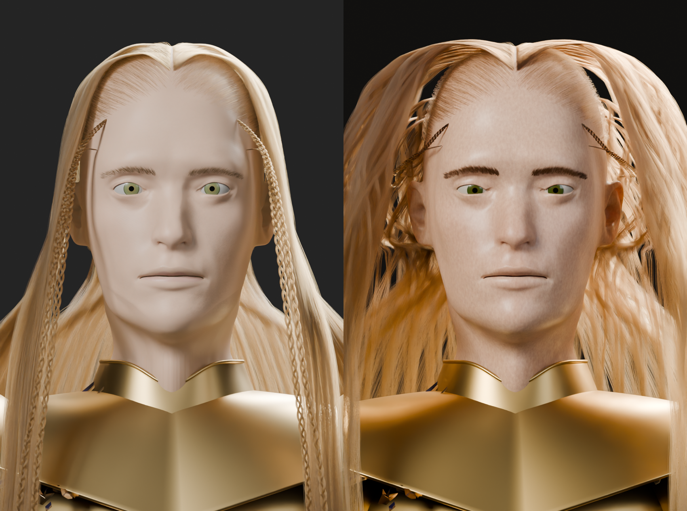
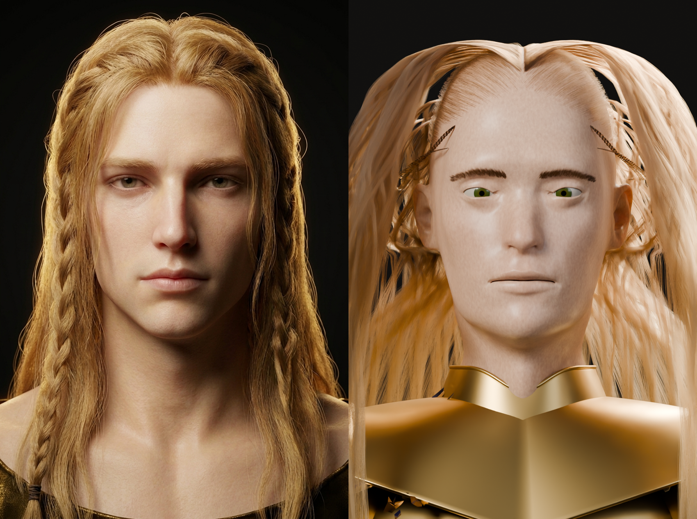
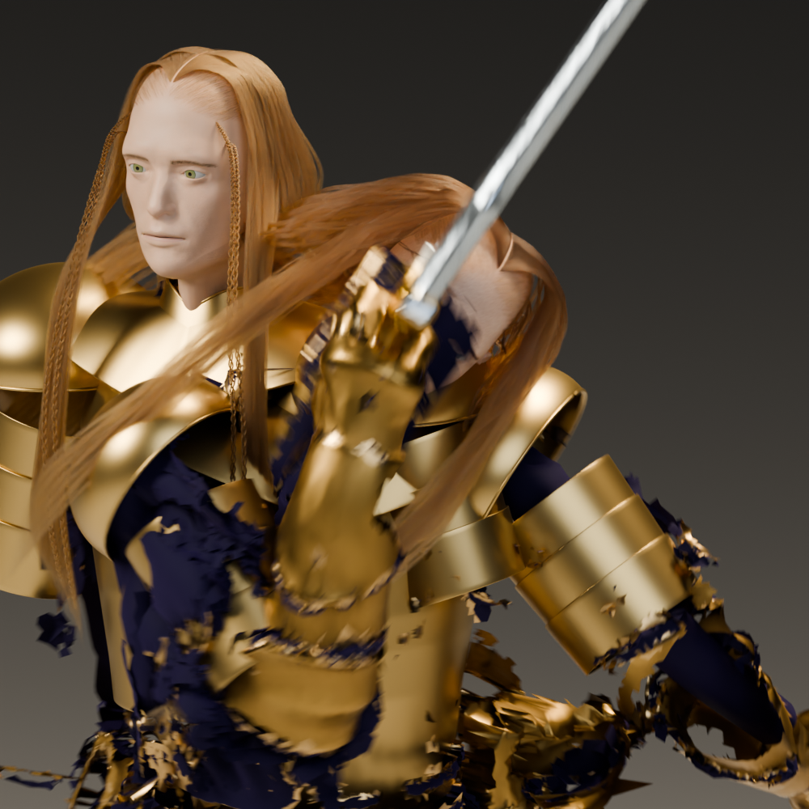

# Godwyn likeness closeout

## Result

The published Godwyn character was replaced only after iteration 06 passed the visual and mechanical gates. The accepted MPFB head was not regenerated. Armor, cloth, body, and the 121-bone rest rig were not redesigned or edited.

Final views: [front](likeness_i06_front.png), [side](likeness_i06_side.png), [three-quarter](likeness_i06_three_quarter.png).

## What changed

- **Skin:** procedural fine color variation, localized nose/cheek/lid/lip redness, 24% Principled subsurface at a 3.2 mm scale with `[1.0, 0.42, 0.18]` radius balance, fine roughness variation, restrained coat, and a very low albedo emission mask driven at the SPEC-required 2.5 strength. The SPEC pale base color remains the anchor rather than an unmodulated flat color.
- **Hair:** the retained 32,900-strand native/control/portable system now has warmer reddish-gold direct shading, darker roots, larger clumps, irregular wave, more crown/side volume, a more downward shoulder fall, and two short temple-origin three-bundle braids sweeping rearward. Loose hair still uses all twelve original hair bones; the short braids follow `Head` without simulation.
- **Eyes:** warm natural sclera, darker hazel-green radial iris with limbal ring, thicker upper/lower lid margins, a soft upper-lid closure, lash line/individual lashes, tear ducts, and a slightly lowered gaze.
- **Brows/lips:** two additional tapered brow-fill layers per side; a closed, volumetric upper/lower lip shell with a defined neutral seam.

## Validation and publication

- Native source: `models/astra_character_v2_likeness_i06.blend`.
- Native rig: **121 bones**, **0 actions**, rest-matrix error **0.0**, neutral restored **True**.
- Native referenced skinned vertices: **2,842,705**; bad/unweighted: **0**; max weight-sum error **0.0009765625**.
- Head topology remains closed: **79,522 vertices**, **79,520 faces**, zero boundary and non-manifold edges.
- Protected banked armor hashes preserved: **True**.
- Actual hero assembly: 121 bones, valid modifier/control references, rest-transform max error **0.0**.
- GLB round trip: **121 bones**, skin joint counts **[121]**, animations **0**, max world-joint position error **0.0000143051 m**, bad/unweighted referenced vertices **0**.
- Both native and GLB candidates rendered in arms-raised and combat-stress poses on asserted OptiX devices before publication.

Published SHA-256:

- `models/astra_character_v2.blend`: `955d11c06ae9d43a236d46cb038a214f87bfdfc9a554e792f83e8272b3969c63`
- `models/astra_character_v2.glb`: `bdb404abe7f6f6e8bcfc04eb8b8bafce344a1f24f2f5e18948b06c981ba54ee6`

Preserved byte copies:

- `models/astra_character_v2_pre_likeness.blend`: `c5a691c624a67ff299f2bb2822fd04346e4bb6184e0273a2fa8dba9869a86386`
- `models/astra_character_v2_pre_likeness.glb`: `74674393fbc8447b084d62f4ed89f6c44b6b145a720f840926e10ac225fe8775`

## Rising Spin proof

The corrected Rising Spin scene/action was rehosted in memory onto the new published character at the prior exact worst frame, F40. The blade/head exact triangle-overlap count is **0**. Sampled blade-to-head surface distance is **1.449 mm**. Sampled blade-to-hair clearance is **17.562 mm**, after the same **2.0 mm** fiber-radius allowance. This is a frame-40 sampled proof, not a claim of continuous-time collision clearance.

## Honest remaining gap

This is clearly closer than the prior publication, but it is not photographic equality with the concept. The fixed approved MPFB phenotype remains longer/narrower and more stylized than the reference. The procedural groom still shows a more organized center opening and broader guide families than the reference's dense, irregular photographic flyaways; the temple braids are subtler from the front. Lid, tear, lash, and lip inserts remain modeled details rather than scan-level anatomy. Skin pores and redness are procedural, and GLB PBR cannot reproduce the native Cycles SSS/hair response exactly. The original armor/body qualifications from the MPFB delivery remain unchanged.
