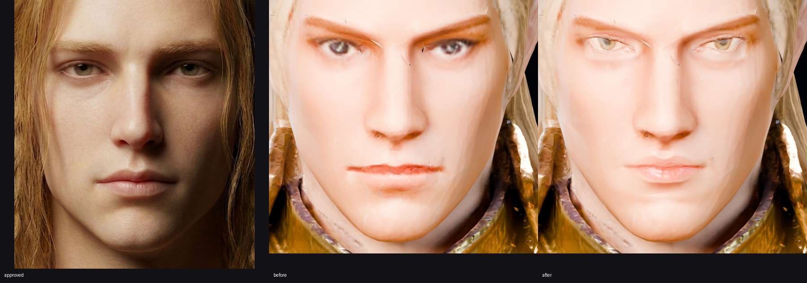
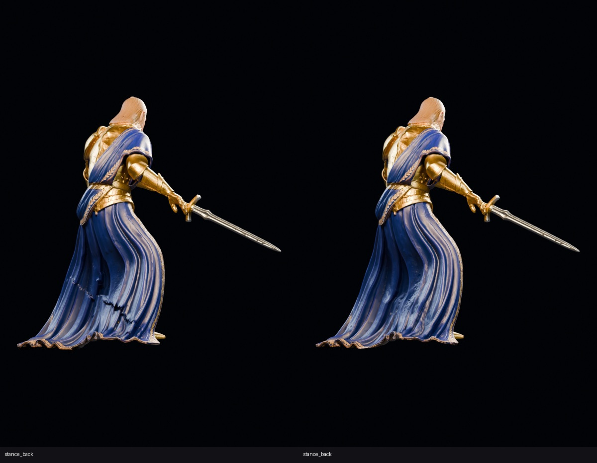

# Godwyn V4 polish

**Published on black-sky at 2026-09-28T22:35:56.729388+00:00**, with documented visual limitations. Deliverables: [astra_character_v4.blend](../../../models/astra_character_v4.blend) and [astra_character_v4.glb](../../../models/astra_character_v4.glb). Both clips and the two assigned materials passed the fresh-import checks.

The accepted V4 assembly is preserved. The rear-robe serration is substantially improved, the sword is seated in the palm, and the face has a separate high-density atlas with clearer eyes and lips. **The face still falls short of the approved portrait.** Cheek/jaw faceting, soft original brows, blunt hair geometry, open fingers, stiff cloth motion, and isolated severe skinning stretches remain. Numeric gate success is not a claim that these are resolved.

All Blender, Cycles baking/rendering, ffmpeg encoding, and image processing ran on **black-sky** in `/home/aaron/godwyn-boss-fight`. Codex inspected the images directly. No Git commands, delegated visual judgments, or relayed-chat instructions were used. Execution output is in [codex_v4p.log](codex_v4p.log).

## Face projection and fallback

The donor was `AstraChar2_Meshy_HeadHair` from black-sky's `models/astra_character_v3.blend`. Its skin_i01 base-color shader was flattened before projection. A weighted least-squares rigid transform with uniform scale **1.21407670** fitted eye centers, nose tip, chin, and estimated ears. Landmarks were picked on unlit front renders and ray-cast onto the surface. Hair obscures the donor ears, so those two estimates received reduced weight; this is an approximate fit, not an anatomical registration.

Residuals, in millimeters:

- Image-left eye: **4.749**; image-right eye: **4.373**.
- Nose tip: **3.593**; chin: **7.685**.
- Image-left ear estimate: **15.121**; image-right ear estimate: **14.160**.
- Unweighted RMS over all six landmarks: **9.512**.

The complete transform, coordinates, weights, and residuals are in [face_build.json](../v4p/face_build.json). No donor geometry remains in the character.

Assigned **2,013 existing skin triangles** to `V4_Face` and added `V4FaceUV`, with independent **2048×2048 base-color, tangent-normal, and roughness maps**. Smart UV projection used a 66° angle limit and 0.012 island margin. Selected-to-active Cycles OptiX baking used a **32 mm cage extrusion, 75 mm maximum ray distance, 16-pixel margin, and 4 samples**. Base color and roughness were baked through emission; normals used tangent-space NORMAL baking. Original V4 appearance was also baked for blending and uncovered regions. Full projection hit approximately **84.48%** of the atlas's skin coverage.

Full-face projection visibly placed blonde donor-hair streaks on the cheeks and was rejected. A broader feature mask also produced doubled outer brows. The delivered fallback therefore projects **eyes and lips only**, retaining V4 eyebrows and all other native facial regions. Two eye ellipses and one lip ellipse use a 22% radial feather, front-facing restriction, and a lateral fade. Approximately **10.64%** of covered atlas pixels receive donor projection. Donor color was matched to the native skin median before blending. Normals are decoded as Non-Color data; packed images were reloaded to avoid stale bake pixels. See [fallback.json](../v4p/fallback.json).

The face material uses the skin_i01 subsurface treatment: weight **0.32**, radius **(1, 0.35, 0.2)**, scale **8 mm**. Warmth/rosiness are retained in the flattened color, without applying the source tint twice.

Measured area-equivalent face density rises from **3.899 to 37.854 texels/cm** on the same triangles; the median triangle density is **37.956 texels/cm**. This is atlas sampling capacity, not newly invented skin detail. Regions retaining V4 pixels remain limited by their original texture. [Density and preservation proof](../v4p/finalcheck.json).

[Full face comparison](../v4p/face_comparison.jpg). The approved image is a visual target, not a matched-lighting comparison. The final eyes and lips are more legible, but the pale highlights, coarse underlying face, and soft brows prevent a portrait-quality likeness pass.

## Robe weights and grip

The first cloth smoothing used 12 Laplacian passes on 109,557 blue-cloth vertices below the belt, 32 spatial neighbors, a 35 mm cutoff, and 0.75 relaxation. Inspection still showed the serrated band, so the refinement used 20 mm spatial cells, a 65 mm Gaussian kernel, a 130 mm cutoff, and eight passes. The scope included **130,198 cloth vertices**, including **20,641 adjacent embroidered seam vertices** within 12 mm of the selected cloth. Including those bordering vertices avoided leaving the decorative trim behind as the cloth moved.

Only Hips and existing Left/Right UpLeg, Leg, Foot, and ToeBase weights were redistributed; other bone influences and total weight were preserved. A smooth transition from Z=1.10 to 1.55 m softened the belt boundary. A final constrained redistribution on **245 hem vertices**, evaluated across all 97 frames, kept the hem inside the requested floor tolerance. No cloth vertices were moved in rest space. Details: [initial weights](../v4p/motion_build.json), [refinement](../v4p/cloth_refine.json), [belt/hem finish](../v4p/cloth_finish.json).

The conspicuous transverse sawtooth band is gone in the final stance back/side renders. Broad lumpy folds, some crease faceting, and rigid-looking robe motion remain.

A 27-position local grip search was followed by a translation along the handle to clear pommel/wrist collisions during slash frames 25–27. The chosen rigid sword adjustment is **5 mm toward the blade**, a rest-world translation of **(-3.405, -0.679, -3.597) mm**. The handle-center reference is **5.318 mm inward** from the nearest right-hand surface, measured against its surface normal. This is a signed local contact estimate, not a volumetric penetration depth or proof of a closed fist. The fingers remain visibly open as authorized. [Grip trials](../v4p/grip_refine.json).

## Motion and mechanical audit

Both source clips were baked parent-first using rest-independent world-space orientations onto the 24-bone V4 rig at **30 fps**. `Combat_Stance` has **51 frames**; `sword_slash_r` has **46 frames**. Maximum orientation discrepancy was **0.000° at Blender float precision**. Source XY root travel is retained; per-frame Z grounding was applied.

Every integer frame was audited. The stretch percentile excludes rest edges shorter than 2 mm, consistent with the existing audit. Collision results are BVH triangle-overlap counts, not swept-volume certification between frames.

- **Combat_Stance:** maximum edge-stretch p99 **1.57512** against the 2.2 limit; lowest body point **+2.147 mm**; lowest sole per frame **+2.147 to +2.303 mm**; lowest blade point **+955.295 mm**. Blade/body overlaps **0**; whole-sword/non-grip-body overlaps **0**.
- **sword_slash_r:** maximum edge-stretch p99 **1.85942**; lowest body point **−14.035 mm**, within the 20 mm tolerance; lowest sole per frame **+0.829 to +2.980 mm**; lowest blade point **+1,021.575 mm**. Blade/body overlaps **0**; whole-sword/non-grip-body overlaps **0**.
- Zero unweighted or invalid-weight-sum vertices. Maximum native body weight-sum error **1.751e−7**.
- Intentional palm contact remains: whole-sword/all-body overlaps reach **439** pairs in stance and **444** in slash. Thus “zero sword/body” means **zero outside the grip**, with hand triangles classified by all three vertices having RightHand weight above 0.5. It does not mean the handle floats outside the hand.
- **Maximum individual edge stretch remains very high: 116.67× in stance and 117.14× in slash.** The p99 gate hides this small tail of extreme deformation. This remains a skinning-quality limitation despite the visibly improved rear fold; the model is not certified free of local stretching or body self-intersection.

[All stance measurements](../v4p/Combat_Stance_audit.json) · [All slash measurements](../v4p/sword_slash_r_audit.json).

## Direct visual inspection

All fourteen final native stills were inspected individually: **1200×1800, Cycles OptiX, 48 samples**. The seven views are present for both rest and Combat_Stance frame 1. [Contact sheet](../v4p/stills_contact.jpg).

- **Rest/front:** intact silhouette and layered costume; open palms and pointed front trim remain obvious.
- **Rest/side:** continuous assembly and long intact robe; hair and facial profile remain coarse.
- **Rest/three-quarter:** useful full-body presentation; sword rests against the palm but is not convincingly grasped.
- **Rest/back:** intact trailing hem and rear panel; heavy, sculpted folds remain.
- **Rest/face:** clearer eyes/lips with no rejected cheek-hair streaks or doubled outer brows; faceted jaw/cheeks, soft brows, and pale highlights remain.
- **Rest/collar:** preserved neck-to-collar continuity; recessed shadow under the jaw and rough gold surface remain.
- **Rest/top-down collar:** assembly stays closed; the blunt hair mass and uneven collar shading remain visible.
- **Stance/front:** readable grounded silhouette; front inner-robe/armor points and open fingers remain.
- **Stance/side:** major serration removed; broad fold shape is smoother but still lumpy.
- **Stance/three-quarter:** clear pose and weapon attachment; cloth responds as skinned geometry rather than simulated fabric.
- **Stance/back:** strongest improvement over the original; the transverse sawtooth band is gone, with residual crease faceting.
- **Stance/face:** feature projection remains registered; it still falls short of the approved portrait.
- **Stance/collar:** continuous through the pose; a dark under-jaw recess remains, without introducing a graft seam.
- **Stance/top-down collar:** continuous assembly retained; hairline/collar shading is uneven at close range.

Four fresh-GLB stance views—front, face, back, and top-down collar—were also rendered at 1200×1800 and inspected. The two-atlas export preserves the overall look; the imported face/hairline has a slightly stronger dark edge, and native subsurface rendering is not exactly reproduced by core glTF. [Round-trip renders](../v4p/roundtrip/).

The two films use **768×768, Cycles OptiX, 20 samples, every frame at 30 fps**, H.264 CRF 18. The camera follows Hips XY while retaining visible vertical motion. All 51 stance frames and all 46 slash frames were inspected in numbered contact sheets. Stance stays stable. Slash has readable motion but stiff cloth and conspicuously open fingers. The first slash film clipped the sword and was rejected; the final camera uses the full motion's evaluated bounds plus 12% margin, with a constant scale rather than changing zoom.

[Stance film](../v4p/film/Combat_Stance.mp4) · [Slash film](../v4p/film/sword_slash_r.mp4) · [Numbered contact sheets](../v4p/film/).

## Two-material GLB verification and preservation

The delivered character uses exactly **two assigned materials**, `V4_Face` and `V4_BodySword`. The latter combines the body and sword into a **4096×2048** PBR atlas, retaining each original map's 2048-pixel width. The dedicated face UV/map remains independent. Body masked base color and roughness were flattened before export; all required images are packed in the blend and embedded in the GLB.

Fresh GLB import preserved all **24 bones**, their hierarchy, both exact clip names/frame counts, and both materials. The largest rest-joint discrepancy is **0.01875 mm**. A deterministic sample of 300 vertices per mesh was checked across all 97 frames, using rest positions plus bone-weight vectors to distinguish coincident split vertices. Maximum native/imported deformation differences:

- Stance body **0.02964 mm**, sword **0.00954 mm**.
- Slash body **0.03550 mm**, sword **0.01646 mm**.

The initial export failed the strict 0.1 mm sample gate because Blender 5.2 silently discards influences at or below 0.0001 even when “all influences” is enabled. For this export only, the exporter threshold was changed in memory to zero and restored afterward; installed Blender files were not modified. The final export passes the original strict tolerance. All imported weights are valid. Sampling is not an exhaustive vertex-by-vertex deformation proof. [Round-trip data](../v4p/roundtrip.json).

The body's **279,316 vertex coordinates and 308,821 triangles** match the accepted V4 source exactly. SHA-256 over ordered float32 coordinates and ordered int32 loop vertex indices is identical before and after:

`963313d2c41177722bc1e7e1bf24776b8bd6021c1cb7ac623a29460a8ba11a4b`

All fourteen protected black-sky source files—including the original V4 candidate and V3 model variants—retain their original SHA-256, size, and modification time. The donor on black-sky is the authoritative source for this run; it was not replaced by a potentially different Mac copy. [Preservation proof](../v4p/finalcheck.json).

Scripts are prefixed `scripts/astra_v4p_`. Intermediate rejected renders and builds remain under `renders/astra/v4p/` for traceability. Two concurrent background jobs were killed; sequential reruns completed. Blender also printed pre-existing optional-extension `cattrs` and unavailable MeshOptimizer warnings; this run used uncompressed GLB export and verified its output independently.

## Published file identity

- `models/astra_character_v4.blend`: 80488044 bytes; SHA-256 `6a73a31393c94fa0b60e257fd5c13abd932572bb86cc12d2b49fd1fb30809912`.
- `models/astra_character_v4.glb`: 59679616 bytes; SHA-256 `5aba0d505692514a684a7dc6767f80fd188b722e4d55e442521a5bc0e9afc24f`.

[Publication manifest](../v4p/publication.json) · [Direct inspection record](../v4p/inspection.json).
